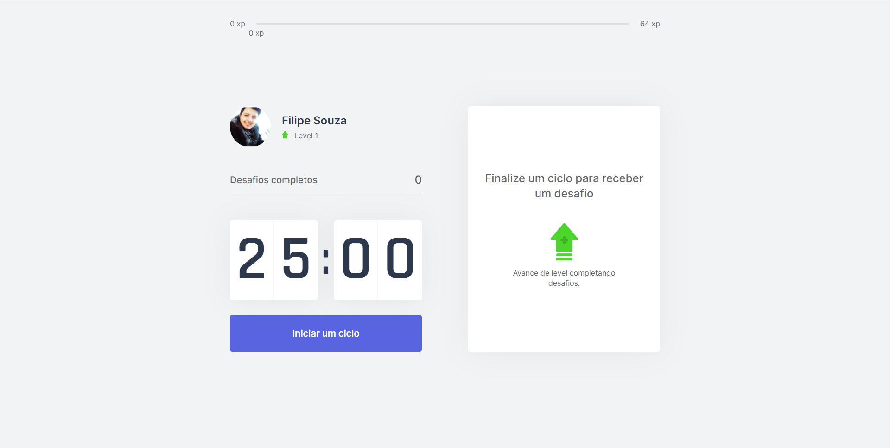
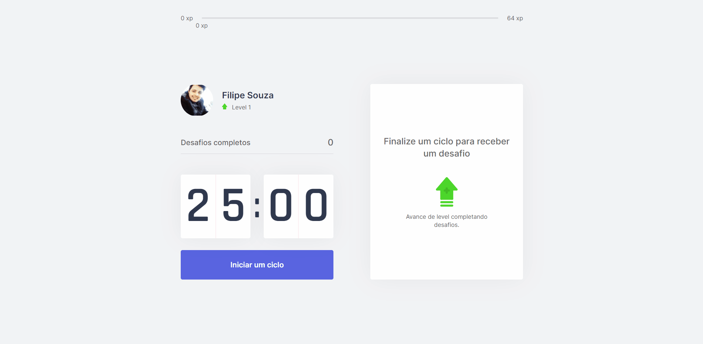

### Projeto em progresso...

Este projeto foi construído na semana do NLW 4 realizado pela escola de programação Rocketseat, consiste em um gerenciador de tempo para realização de alguma tarefa, semelhante a pomodoro, onde o cumprimento de algumas tarefas dão pontos de XP ao usuário fazendo com que ele aumente de level.

Projeto com deploy feito na Vercel: [nlw-4-move-it-eight.vercel.app](https://nlw-4-move-it-eight.vercel.app/)

# Inicializando o projeto

Primeiramente instale as dependencias do projeto:

```bash
npm install
# ou
yarn install
```

Para rodar o projeto use o comando no terminal:

```bash
npm run dev
# ou
yarn dev
```
# Telas do projeto

 



# Tecnologias do projeto

- ReactJS
- NextJS

# Atualizações

- [x] Adicionar tela de Login com github.
- [ ] Adicionar Ranking de usuários.
- [ ] Adicionar compartilhamento com Twitter.
